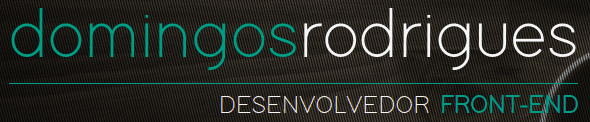
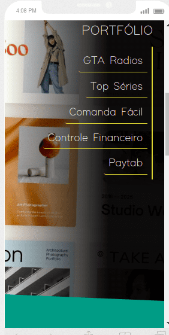

  

<h1 align="center">Domingos Rodrigues - portfólio</h1>
<h2>Sobre:</h2>

Site pessoal com portfólio de desenvolvedor front-end

Live: <a href="http://domingos-rodrigues.vercel.app/">domingos-rodrigues.vercel.app</a>
 

 

<h2>Objetivo:</h2>

Site desenvolvido para expor meus projetos.

<h2>Funcionalidades:</h2>
<ul>
  <li>Contém uma página estática dedicada a cada projeto.</li>
  <li>Cada página de projeto inclui descrição, link para o projeto online, gif com demo do projeto e screenshots da aplicação em diferentes formatos de tela.</li>
  <li>Responsividade.</li>
</ul>
<h2>Tecnologias utilizadas:</h2>
<ul>
  <li>React</li>
  <li>Next JS</li>
  <li>Typescript</li>
</ul>